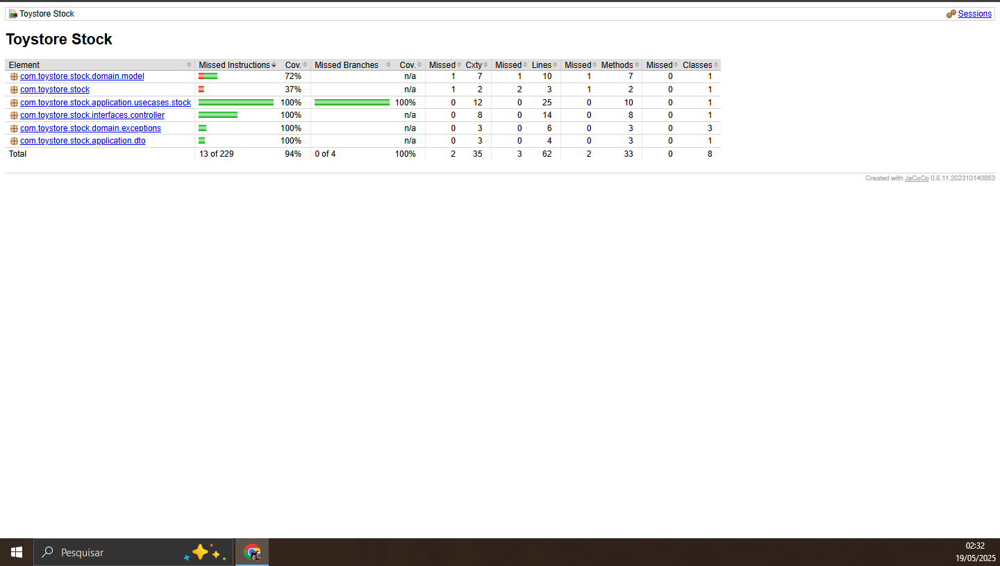

## Documentação sobre mongo
#### https://spring.io/projects/spring-data-mongodb

## Instalação do mongo para usar(docker)
### Baixar e rodar ou apenas rodar
Instalar: docker run --name meu_mongo -d -p 27017:27017 mongo  
Iniciar: docker start meu_mongo  
Stopar: docker stop meu_mongo  
Valiar: docker ps  

### Uso do shell
Caso esteja utilizando com docker, ele já vem com o shell na imagem. Do contrário, necessário baixar o shell separado  
Utilizar o shell: docker exec -it meu_mongo mongosh
Acessar console do container: docker exec -it meu_mongo bash


## Executando o projeto com Docker
### Baixar e rodar ou apenas rodar
A imagem docker será criada conforme instruções no [DockerFile](Dockerfile)

### Executando projeto local
Criar Imagem docker do projeto: docker build -t toy-store-stock .  
Executar a Imagem docker localmente: docker run -p 8080:8080 toy-store-stock  
Verificar container criado: http://localhost:8080/stock/swagger-ui/index.html#/

### Executando projeto via imagem no dockerhub
#### Criando Imagem no docker hub
Tagueando imagem: docker tag reservei-app:latest majorv22/toy-store-stock:1.0  
Fazendo deploy no dockerhub: docker push majorv22/toy-store-stock:1.0

### Instruções para execução local 
1 - Criar uma rede para comunicação entre a aplicação e o mongo
docker network create toystorerede

2 - Subir container do mongo com a rede criada
docker run --name mongo-toy-store --network toystorerede -d -p 27017:27017 mongo

3 - Executar container com imagem da aplicação
```
docker run `
  --name app-toy-store-stock `
  --network toystorerede `
  -e SPRING_PROFILES_ACTIVE=docker `
  -e SPRING_DATA_MONGODB_URI=mongodb://mongo-toy-store:27017/stock `
  -d -p 8080:8080 `
  toy-store-stock
```

## Executando testes com Jacoco

### Utilização do Jacoco
1 - Colocar Jacoco no projeto com maven  
  link:https://www.eclemma.org/jacoco/  
  Versão utilizada: 0.8.14
  Cobertura mínima: 80%  
  OBS: Inserido no projeto via plugin

2 - Testando projeto  
  Executar comando: mvn clean verify

3 - Validando report  
  Verificar arquivo: Maven: target/site/jacoco/index.html

4 - Execução dos testes  


